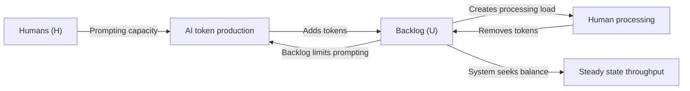
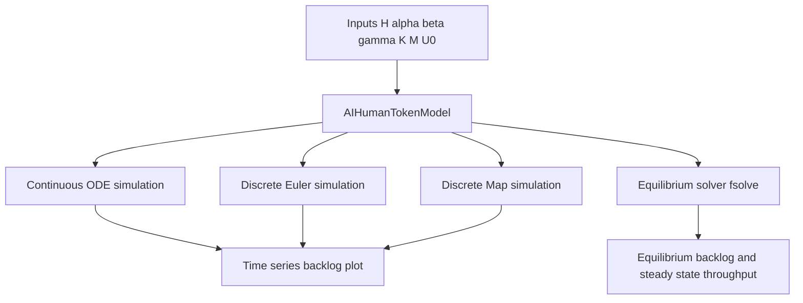

# AI-Human Token Dynamics

An interactive **consumer-resource model** (inspired by predator-prey mathematics) for simulating AI token production versus human processing capacity.

## Overview

This project models a common AI-assisted workflow:

- AI systems generate output quickly (tokens, text, code, analysis).
- Humans both prompt the AI and process the resulting output.
- Human time and attention create a natural bottleneck.

As backlog grows, humans spend more effort reading and editing, and less effort prompting. That feedback loop creates self-regulating behaviour consistent with consumer-resource dynamics.

## Core Variables

- `U(t)`: backlog of unprocessed tokens (the resource)
- `H`: number of humans (the consumers)
- `alpha`: tokens generated per prompt
- `beta`: maximum tokens one human can process per hour
- `gamma`: maximum prompts one human can issue per hour (when not overloaded)
- `K`, `M`: saturation constants (Holling type II response terms)

## What the Model Shows

- Stable throughput when capacity and production are balanced
- Very large backlog growth when human capacity is insufficient
- Diminishing returns from simply increasing AI speed or team size

## System Dynamics Diagram


## Simulation Paths Diagram



## Why This Model

Linear assumptions like “faster AI means proportionally more output” often fail in practice. Human cognitive limits introduce nonlinear effects, saturation, and bottlenecks. This model helps reasoning about such constraints quantitatively.

Typical questions it supports:

- How many people are needed to keep backlog manageable?
- What happens when `alpha` increases significantly?
- Where is the actual bottleneck in an AI-augmented workflow?
- How does team size change equilibrium backlog versus useful throughput?

## Running the Notebook

This project uses `uv` for dependency and environment management.

### Install dependencies

```bash
uv sync
```

### Launch the marimo notebook editor

```bash
uv run marimo edit notebooks/main.py
```

### Optional validation

```bash
uv run marimo check notebooks/main.py
```

## Key Python Packages

### marimo

- **Purpose**: Reactive notebook and app framework used for the interactive model UI.
- **Details**: Drives the notebook cell graph, controls, and reactive rendering.
- **Version**: `0.22.4`
- **License**: Apache License 2.0

### numpy

- **Purpose**: Numerical array operations and vectorised calculations.
- **Details**: Used for time grids, discrete simulation arrays, and parameter ranges.
- **Version**: `2.4.4`
- **License**: Multi-license distribution (metadata expression: `BSD-3-Clause AND 0BSD AND MIT AND Zlib AND CC0-1.0`)

### scipy

- **Purpose**: Scientific algorithms for integration and root finding.
- **Details**: Provides `odeint` for ODE simulation and `fsolve` for equilibrium solving.
- **Version**: `1.17.1`
- **License**: SciPy BSD-style core licence with bundled third-party component licences

### plotly

- **Purpose**: Interactive data visualisation.
- **Details**: Renders time-series and scaling charts with zoom/hover support.
- **Version**: `6.6.0`
- **License**: MIT

### pandas

- **Purpose**: Tabular/time-series data tooling.
- **Details**: Available for extension work such as exporting and analysing simulation outputs.
- **Version**: `3.0.2`
- **License**: BSD 3-Clause

## Notebook Features

- Parameter controls for all model inputs
- Simulation mode selection:
  - Continuous (ODE)
  - Discrete Euler
  - Discrete Map
- Interactive Plotly charts (hover, zoom, pan)
- Live equilibrium backlog and throughput display
- Scaling plots across team sizes

## Model Equation

$$
\frac{dU}{dt}
= \alpha \cdot \gamma H \cdot \frac{K}{K + U}
- \beta H \cdot \frac{U}{U + M}
$$

## References

See `docs/references.md` for foundational consumer-resource papers, Holling type II literature, and relevant human-AI collaboration context.

## Extension Ideas

- Add time delays (can produce oscillatory dynamics)
- Introduce stochastic noise in the discrete map
- Model multiple AI systems and quality trade-offs
- Add additional state variables (for example, prompt quality or accumulated knowledge)
- Export simulation outputs for downstream analysis or optimisation
