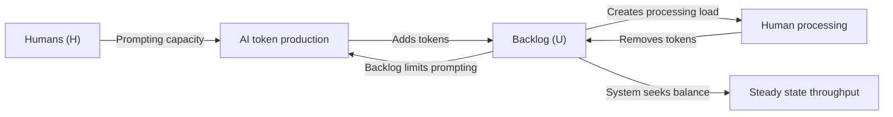
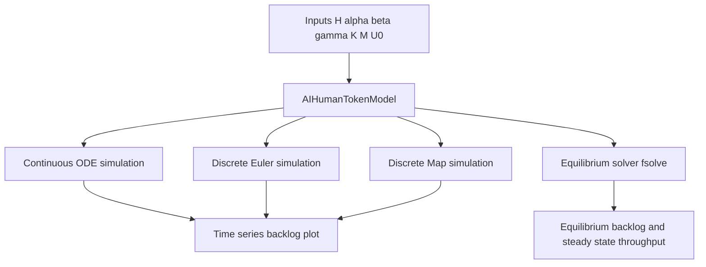

# AI-Human Token Dynamics

An interactive **consumer-resource model** (inspired by predator-prey mathematics) for simulating AI token production versus human processing capacity.

## Overview

This project models a common AI-assisted workflow:

- AI systems generate output quickly (tokens, text, code, analysis).
- Humans both prompt the AI and process the resulting output.
- Human time and attention create a natural bottleneck.

As backlog grows, humans spend more effort reading and editing, and less effort prompting. That feedback loop creates self-regulating behaviour consistent with consumer-resource dynamics.

## Core Variables

- `U(t)`: backlog of unprocessed tokens (the resource)
- `H`: number of humans (the consumers)
- `alpha`: tokens generated per prompt
- `beta`: maximum tokens one human can process per hour
- `gamma`: maximum prompts one human can issue per hour (when not overloaded)
- `K`, `M`: saturation constants (Holling type II response terms)

## What the Model Shows

- Stable throughput when capacity and production are balanced
- Very large backlog growth when human capacity is insufficient
- Diminishing returns from simply increasing AI speed or team size

## System Dynamics Diagram


## Simulation Paths Diagram



## Why This Model

Linear assumptions like “faster AI means proportionally more output” often fail in practice. Human cognitive limits introduce nonlinear effects, saturation, and bottlenecks. This model helps reasoning about such constraints quantitatively.

Typical questions it supports:

- How many people are needed to keep backlog manageable?
- What happens when `alpha` increases significantly?
- Where is the actual bottleneck in an AI-augmented workflow?
- How does team size change equilibrium backlog versus useful throughput?

## Background: Predator-Prey and Consumer-Resource Foundations

This model is inspired by classic predator-prey and consumer-resource dynamics, adapted here for AI production and human processing:

- Quick primer (accessible): Lotka-Volterra equations (Wikipedia)  
  https://en.wikipedia.org/wiki/Lotka%E2%80%93Volterra_equations

- Lotka, A. J. (1925). *Elements of Physical Biology*. Williams & Wilkins.  
  https://doi.org/10.5962/bhl.title.4489
- Volterra, V. (1926). Fluctuations in the abundance of a species considered mathematically. *Nature*, 118, 558–560.  
  https://doi.org/10.1038/118558a0
- Holling, C. S. (1959). Some characteristics of simple types of predation and parasitism. *The Canadian Entomologist*, 91(7), 385–398.  
  https://doi.org/10.4039/Ent91385-7
- Griffen, B. D. (2021). Considerations when applying the consumer functional response in ecological studies. *Frontiers in Ecology and Evolution*, 9, 713147.  
  https://doi.org/10.3389/fevo.2021.713147

## Why This Problem Matters

This is not only a modelling exercise. In production settings, organisations are deploying increasingly capable AI systems into workflows where human review, correction, and decision-making remain constrained. When generation speed rises faster than human processing capacity, teams can experience:

- **Quality drift**: more output than can be meaningfully reviewed, with higher risk of unnoticed errors.
- **Cognitive overload**: sustained attention fragmentation and reduced judgement quality.
- **Hidden queueing costs**: growing response lag, delayed decisions, and backlog accumulation that is often invisible until it becomes operationally painful.
- **Misleading productivity signals**: high token/output volume may look like progress while useful throughput stagnates.
- **Governance and safety pressure**: compliance, traceability, and accountability become harder when review loops cannot keep pace.

These concerns align with themes in the literature listed in `docs/references.md`: classic consumer-resource and saturation dynamics, queueing and bottleneck behaviour in constrained systems, and contemporary human-AI collaboration research on cognitive load, oversight limits, and reliability under scale.

The practical goal is to move from “more AI output” to **sustainable, high-quality human-AI throughput**.

### People Risks in Unmitigated AI Use

Without explicit safeguards, AI adoption can create direct people risks:

- **Cognitive overload and burnout risk**: sustained review load and context switching can reduce judgement quality over time (see Wang et al., 2026: https://doi.org/10.1007/s10462-026-11510-z).
- **Automation bias and over-trust**: plausible AI outputs can be accepted too quickly, increasing unnoticed error risk (see Jiang et al., 2025: https://pmc.ncbi.nlm.nih.gov/articles/PMC12307350/).
- **Deskilling and dependency**: if teams rely on AI outputs without deliberate skill maintenance, expert capability can erode (see Liang, 2026: https://arxiv.org/html/2603.27438v1).
- **Role stress and accountability ambiguity**: unclear ownership of AI-assisted decisions can increase psychological strain and organisational risk.
- **Perverse performance incentives**: measuring token volume rather than verified outcomes can reward speed over quality and safety.

These are not only technical failure modes; they are socio-technical risks affecting wellbeing, trust, and decision quality.

### Mitigation Principles (People-Centred)

- **Measure useful throughput, not raw output volume**: track validated outcomes, rework rates, and queue age.
- **Protect review capacity**: set explicit review budgets and escalation thresholds when backlog crosses limits.
- **Maintain human accountability**: define who signs off on high-impact decisions and what evidence is required.
- **Design for cognitive ergonomics**: reduce context switching, prioritise high-risk items, and rotate intensive review work.
- **Govern with recognised frameworks**: align practice with NIST AI RMF (https://www.nist.gov/itl/ai-risk-management-framework) and OECD AI Principles (https://oecd.ai/en/ai-principles).

For source literature, see `docs/references.md`.

## Running the Notebook

This project uses `uv` for dependency and environment management.

### Install dependencies

```bash
uv sync
```

### Launch the marimo notebook editor

```bash
uv run marimo edit notebooks/main.py
```

### Optional validation

```bash
uv run marimo check notebooks/main.py
```

## Key Python Packages

### marimo

- **Purpose**: Reactive notebook and app framework used for the interactive model UI.
- **Details**: Drives the notebook cell graph, controls, and reactive rendering.
- **Version**: `0.22.4`
- **License**: Apache License 2.0

### numpy

- **Purpose**: Numerical array operations and vectorised calculations.
- **Details**: Used for time grids, discrete simulation arrays, and parameter ranges.
- **Version**: `2.4.4`
- **License**: Multi-license distribution (metadata expression: `BSD-3-Clause AND 0BSD AND MIT AND Zlib AND CC0-1.0`)

### scipy

- **Purpose**: Scientific algorithms for integration and root finding.
- **Details**: Provides `odeint` for ODE simulation and `fsolve` for equilibrium solving.
- **Version**: `1.17.1`
- **License**: SciPy BSD-style core licence with bundled third-party component licences

### plotly

- **Purpose**: Interactive data visualisation.
- **Details**: Renders time-series and scaling charts with zoom/hover support.
- **Version**: `6.6.0`
- **License**: MIT

### pandas

- **Purpose**: Tabular/time-series data tooling.
- **Details**: Available for extension work such as exporting and analysing simulation outputs.
- **Version**: `3.0.2`
- **License**: BSD 3-Clause

## Notebook Features

- Parameter controls for all model inputs
- Simulation mode selection:
  - Continuous (ODE)
  - Discrete Euler
  - Discrete Map
- Interactive Plotly charts (hover, zoom, pan)
- Live equilibrium backlog and throughput display
- Scaling plots across team sizes

## Model Equation

$$
\frac{dU}{dt} = \alpha \cdot \gamma H \cdot \frac{K}{K + U} - \beta H \cdot \frac{U}{U + M}
$$

## References

See `docs/references.md` for foundational consumer-resource papers, Holling type II literature, and relevant human-AI collaboration context.

## Extension Ideas

- Add time delays (can produce oscillatory dynamics)
- Introduce stochastic noise in the discrete map
- Model multiple AI systems and quality trade-offs
- Add additional state variables (for example, prompt quality or accumulated knowledge)
- Export simulation outputs for downstream analysis or optimisation
